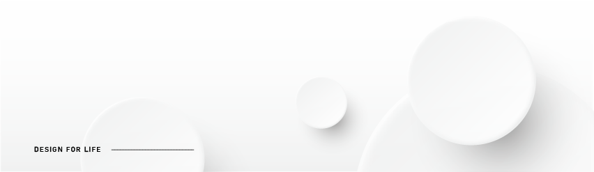

<h1>Hi , I'm Gina! </h1>

## 💡 About Me  
<h4>	
	
你好！我是紀鑑珈，一名正在研究前端技術的視覺設計師。 
</h4>	

出生於1993年，熱衷學習並分享知識來解決問題。 
<b>擅長溝通、規劃、處理細節，獨立亦能團隊合作。</b> 
希望透過以人為本的設計讓生活更加美麗與便利。 

   
	
## 🚀 My Skills
✔5年設計工作經歷，曾任職於公部門、英國設計公司。 
✔擅長整合事務與處理需注意細節及精確性的工作。 
 
★ 設計 👉 平面設計、UI/UX、影像剪輯、體驗研究  
★ 企劃 👉 社群行銷、文案撰寫、研究分析  
★ 行政 👉 簡報發表、公文撰寫、小額採購  
★ 語言 👉 多益黃金證書、日文N5 

 

## 🎯 相關證書
### Coursera
- Google UX Design Course Certificate [課程連結](https://www.coursera.org/professional-certificates/google-ux-design?utm_source=gg&utm_medium=sem&utm_campaign=15-GoogleUXDesign-ROW&utm_content=B2C&campaignid=12566638067&adgroupid=119528847077&device=c&keyword=google%20ux%20design%20certificate&matchtype=b&network=g&devicemodel=&adpostion=&creativeid=507197228289&hide_mobile_promo&gclid=Cj0KCQjwheyUBhD-ARIsAHJNM-N7QtNrMavWVGfXMwqW22cNFK6EiW9pVpG9GeYserPn6wh6U_GuvQIaAkUEEALw_wcB)
  

    
查看證書

    
  

  
### Google數位學程
- The fundamentals of Digital Marketing [課程連結](https://learndigital.withgoogle.com/digitalgarage-tw/course/digital-marketing)
  

    
查看證書

   
  

  
 

 

## 🎨 Graphic Design
- :hammer_and_wrench: [設計線上作品集](https://gina12504.wixsite.com/website) - `WIX`
- 工業設計媒體傳達組出生，研究所就讀成大創產所-品牌管理組。 
- 這幾年來，以平面與網頁設計為主，一路上不知不覺地學會影片剪輯、寫過翻譯，也曾操作公部門社群媒體並於四個月內達成年度目標! 
 

 

 

  &emsp;

 

 

## 💻 Frontend Development
- :crossed_swords: 目前以 `CSS`為主攻項目，同時努力學習 `JS`等框架，未來希望成為能與前端工程師溝通無障礙的UIUX設計師! 
- 📚預計進修 : `Tailwind CSS` `Vue.js` `React.js`  
 

<!--  -->

 

	
	

  

### :zap: 我的網站們
  
- [四癌篩檢補助資訊網站](https://shujhen.github.io/Screening-for-Four-Major-Cancers/index.html)  [持續建立中...] - `HTML`/`CSS`/`Bootstrap`/`Javascript`
- [糕點店形象一頁式網站](https://chienchiac.github.io/bartsai/home.html) - `HTML`/`CSS`/`Bootstrap`
- [易經占卜網站](https://chienchiac.github.io/Predict/Predict.html) - `HTML`/`CSS`/`Javascript`
- [辨色遊戲](https://chienchiac.github.io/ColorGame/0426_Color_Final.html) - `HTML`/`CSS`/`Javascript`
- [天氣即時預報 API練習](https://chienchiac.github.io/Weather/weather_trypic.html) - `HTML`/`CSS`/`Javascript`
- [BMI計算器 Vue練習](https://chienchiac.github.io/BMI_Vue/BMI_Vue.html) - `HTML`/`CSS`/`Vue`
- [仿微軟首頁切版](https://chienchiac.github.io/Microsoft/micro.html) - `HTML`/`CSS`/`Javascript`
   

## 🛠️ Software & Tools

 

## 😊 Get in Touch!

 

	

<!--img align="right" alt="Coding" width="450" src="https://camo.githubusercontent.com/6607041227d81f650340ff070cc2843518acad359b57e5bb054a9fb7127aa041/68747470733a2f2f63646e2e6472696262626c652e636f6d2f75736572732f323634363432332f73637265656e73686f74732f353530373139362f636f6d70757465722e676966" data-canonical-src="https://cdn.dribbble.com/users/2646423/screenshots/5507196/computer.gif" style="max-width:100%;"/-->
